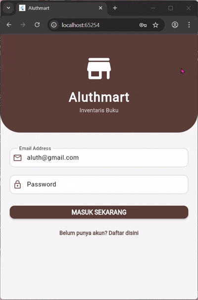

# H1D023020_responsi2_paket3

# Analisis Proyek Responsi 2 - Inventaris Buku 

Proyek ini adalah aplikasi Mobile untuk manajemen inventaris buku (Aluthmart) yang dibangun menggunakan Flutter dan terintegrasi dengan Firebase. Aplikasi ini mendemonstrasikan implementasi Autentikasi dan alur manipulasi data (CRUD) yang tersinkronisasi secara Real-time.

---

## 👤 Identitas Pembuat

| Data | Keterangan |
|------|-----------|
| Nama | Alya Luthfi Kharimah |
| NIM | H1D023020 |
| Shift Baru | F |
| Shift Asal | C |

---

## 🎥 Video Demo Aplikasi

---

## 📡 Spesifikasi API (Firebase SDK)

Aplikasi ini tidak menggunakan REST API konvensional, melainkan Firebase SDK yang langsung berkomunikasi ke Google Cloud.

---

## 1. Authentication API

Digunakan untuk mengelola akses pengguna.

| Fungsi/Method | Kegunaan | Ekuivalen REST API |
|---------------|----------|-------------------|
| signInWithEmailAndPassword | Verifikasi email & password. Mengembalikan token sesi. | POST /login |
| createUserWithEmailAndPassword | Membuat akun baru di Firebase. | POST /register |
| signOut | Menghapus token sesi di perangkat. | POST /logout |

---

## 2. Firestore Database API

Digunakan untuk manipulasi data buku dalam koleksi `books`.

**Collection Reference:** `books`

| Operasi | Method SDK | Deskripsi Teknis |
|---------|-------------|------------------|
| READ (Realtime) | `.snapshots()` | Membuka koneksi WebSocket permanen untuk streaming data real-time. |
| CREATE | `.add(Map<String, dynamic>)` | Menambah dokumen baru dengan Auto-ID. |
| UPDATE | `.doc(id).update(Map)` | Update sebagian data berdasarkan doc_id. |
| DELETE | `.doc(id).delete()` | Menghapus dokumen berdasarkan doc_id. |

---

## 🧠 Analisis Kode & Logika Program

Berikut analisis teknis mendalam untuk modul-modul dalam aplikasi:

---

## 1. Entry Point & Konfigurasi (lib/main.dart)

### Komponen Kode
**ensureInitialized()**  
• Flutter Engine Binding  
• Harus dipanggil sebelum `runApp()` untuk menyiapkan integrasi native dan Firebase.

**Firebase.initializeApp**  
• Async Initialization  
• Menghubungkan proyek Flutter dengan Firebase Cloud sebelum UI berjalan.

**ThemeData**  
• Global Styling  
• Style aplikasi dibuat terpusat (warna coklat 0xFF5D4037, rounded input).  
• Mengikuti prinsip DRY: 1 perubahan → seluruh UI ikut berubah.

---

## 2. Halaman Login (lib/pages/login_page.dart)

### Komponen Kode
**signInWithEmailAndPassword**  
• Token-Based Auth  
• Mengirim kredensial ke server Google dan menerima Auth Token.

**pushReplacement**  
• Stack Management  
• Menghapus halaman Login dari stack agar user tidak kembali ke form login setelah sukses login.

**try-catch**  
• Exception Handling  
• Menampil­kan error Firebase dengan SnackBar ramah user.

---

## 3. Halaman Registrasi (lib/pages/register_page.dart)

### Komponen Kode
**_isLoading**  
• Race Condition Control  
• Mencegah user klik tombol register berkali-kali (hindari duplikasi akun).

**createUser...**  
• Server-Side Account Creation  
• Firebase memvalidasi email, password, dan membuat record akun.

**Navigator.pop**  
• Navigation Stack  
• Setelah register selesai, user dikembalikan ke Login Page.

---

## 4. Halaman Utama / Dashboard (lib/pages/home_page.dart)

### Komponen Kode
**StreamBuilder**  
• Reactive Programming  
• Membuka koneksi WebSocket ke Firestore.  
• UI auto-update jika data di server berubah.

**ListView.builder**  
• Memory Optimization  
• Menggunakan lazy-loading, hanya item yang terlihat di-render.

**_deleteBook**  
• Direct Document Access  
• Menghapus dokumen berdasarkan ID.  
• Karena memakai stream, UI otomatis menghilangkan item tanpa setState().

---

## 5. Halaman Form Buku (lib/pages/form_book_page.dart)

Halaman ini bersifat **polimorfik**: digunakan untuk **Tambah** dan **Edit** data.

### Komponen Kode
**initState**  
• Lifecycle Hook  
• Melakukan pre-fill input saat mode Edit.

**_parseNumber**  
• Data Sanitization  
• Membersihkan input angka dari simbol seperti Rp, titik, koma  
(Regex `[^0-9]` untuk menjaga database tetap type-safe).

**_isEdit logic**  
• Conditional Logic  
• Memilih jalur eksekusi: tambah (`add()`) atau edit (`update()`).  
• Mengurangi duplikasi kode secara signifikan.

---

## 🗃️ Spesifikasi Data (Firestore NoSQL)

Aplikasi menggunakan struktur dokumen dalam koleksi `books`.

| Field | Tipe Data | Fungsi |
|--------|-----------|--------|
| judul | String | Nama buku |
| harga | Number (Int) | Angka murni untuk perhitungan |
| jumlah | Number (Int) | Stok buku |
| volume | Number (Int) | Informasi ketebalan/halaman |
| tanggal_masuk | String | Tanggal pencatatan (YYYY-MM-DD) |
| penulis | String | Metadata penulis |
| penerbit | String | Metadata penerbit |

---

